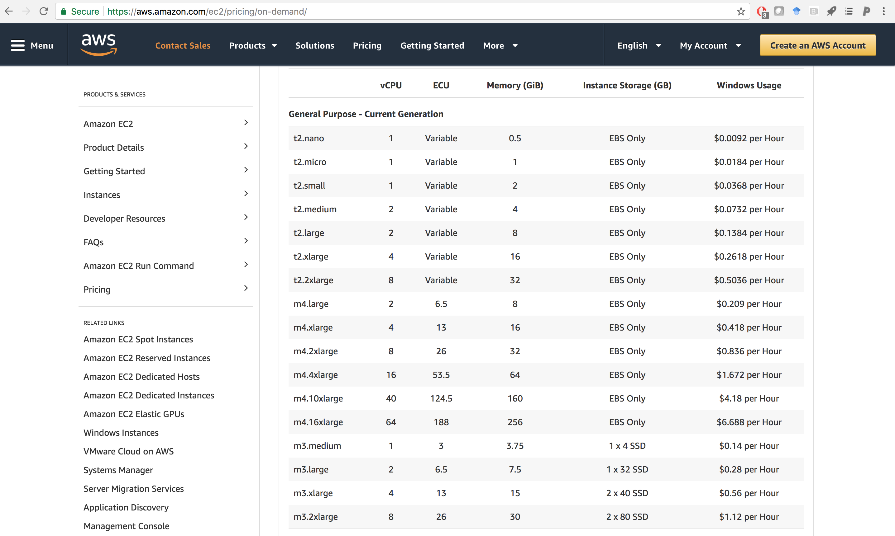
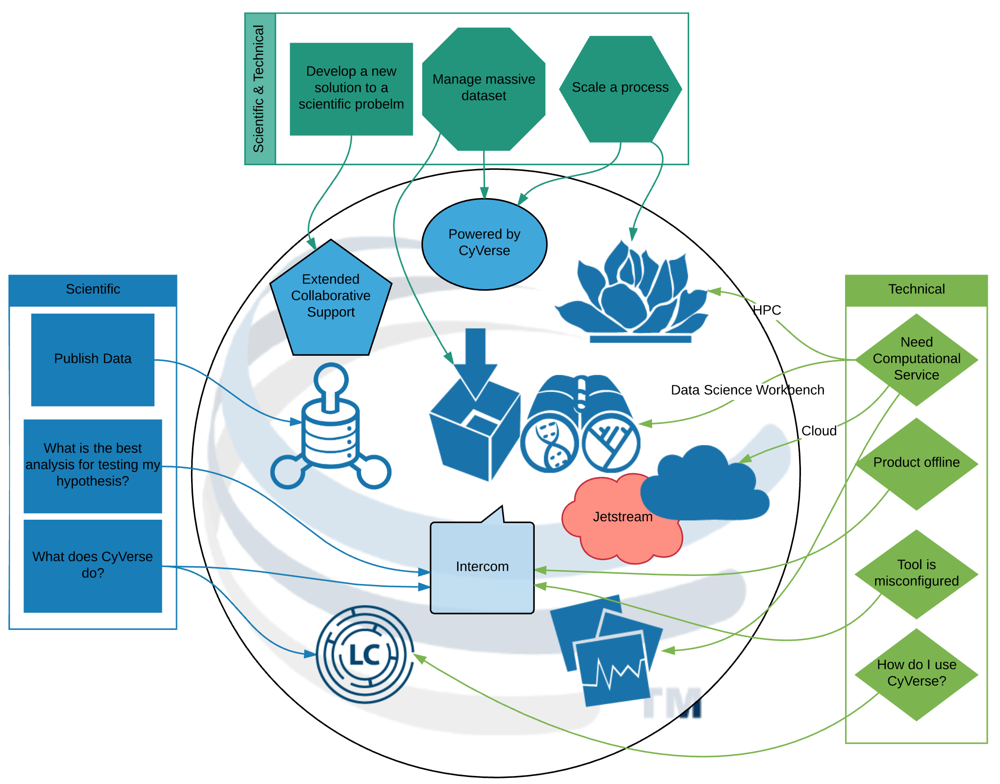

---

<span style="font: fsmall-caps bold 24px/1 sans-serif; font-size: 150%">Leveraging CyVerse for GIS on HPC and Cloud</span>

###### November 15, 2017
###### Tyson Lee Swetnam
###### Science Informatician

---

### Contact

[http://www.cyverse.org/](http://www.cyverse.org/)

email: tswetnam@cyverse.org

github: tyson-swetnam

twitter: tswetnam

---

### GIS beyond my laptop or desktop 

---

Online GIS engines 


---

Massive amounts of data are online


---

Well, that's cool, but...

---

How can I use these platforms and data for my research?

---

Build my own GIS Data Scientist workbench!

---

 

---


---

 

---

### A Data Science Workbench allows me to: 

- Send my algorithms to the data and compute <!-- .element: class="fragment" -->
- Work in my preferred environment, language, and libraries <!-- .element: class="fragment" -->
  - Python, R, C++, Matlab, Spark, etc. <!-- .element: class="fragment" -->

---

Moving my preferred software stack to the cloud or HPC...

---


---


---

## Why Containerize?

- Dependencies can be wicked problems <!-- .element: class="fragment" -->
- Compiling software is slow <!-- .element: class="fragment" -->
- Reproducability is hard <!-- .element: class="fragment" -->

---

I don't have money to buy time on AWS...


---

## CyVerse [Atmosphere](https://cyverse.org/atmosphere)

+++

- Linux (Centos, Ubuntu)
- 1 CPU  to 16 CPU 
- 4 GB to 128GB RAM 
- Attach (swap) TB size storage volumes    
- emulated web shell and desktop 

---

Being awesome with cloud and HPC doesn't just happen


---

@title[Docker RStudio]

## <span style="color: #e49436">Docker + RStudio</span>
[http://learning.cyverse.org/](http://learning.cyverse.org/)
<br>

```shell
$ ezd
$ sudo usermod -aG docker $USER
$ exit
$ docker pull rocker/geospatial
$ docker run -d -p 8787:8787 rocker/geospatial

Done!

```

@[1](install Docker)
@[2](change `sudo` privileges)
@[3](exit and restart terminal window)
@[4](pull the Rocker/Geospatial Rstudio-Server from DockerHub)
@[5](Run the Container in detached mode `-d` on port `-p 8787:8787`)
@[7](Open the Instance's IP address w/ port number in a new browser window)

---

@title[QGIS-GRASS-RStudio native build]

## <span style="color: #e49436">QGIS + GRASS + RStudio</span>
<br>

```shell
$ git clone https://github.com/cyverse-gis/focus-forum.git
$ cd focus-forum/atmo
$ . install_qgis.sh
$ . build_grass.sh
$ . install_rstudio.sh

```

@[1](Clone a public Github Repo)
@[2](Change into the directory with the installation scripts)
@[3](Install QGIS)
@[4](Build GRASS 7.2 from source)
@[5](Install RStudio)
@[6](Open the Instance's IP address w/ port number in a new browser window)
@[7](Launch Web Desktop with Apache Guacamole)

---



---
